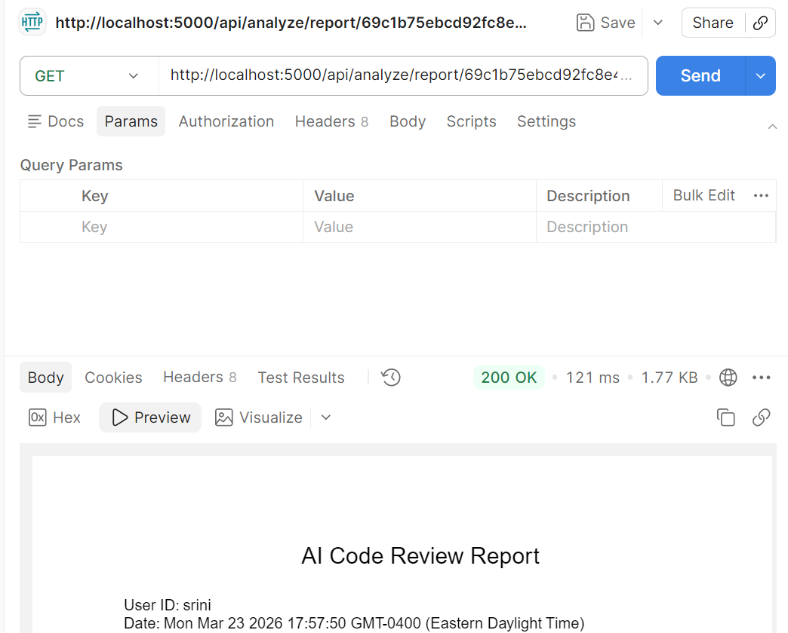

# AI Code Review Assistant
## 📌 Project Overview
AI Code Review Assistant is a web-based application designed to help developers automatically analyze their code. It detects potential issues, suggests improvements, and enhances overall code quality.

---

## 🎯 Objectives
* Improve code quality
* Detect coding mistakes automatically
* Identify security vulnerabilities
* Provide meaningful feedback to developers
* Reduce manual code review effort

---

## 🚀 Features
* User Authentication
* Code Upload
* Basic AI Code Analysis
* Analysis History Storage (MongoDB)
* 📄 Downloadable Reports (PDF)
* Results Dashboard
---
## 🧠 Key Differentiation
Unlike existing tools, this system:
* Performs context-aware analysis across code
* Detects structural and logical issues
* Focuses on security and reliability
* Provides explainable feedback
* Stores analysis history for future reference

---

## 🛠️ Tech Stack
**Frontend**
* React.js
**Backend**
* Node.js
* Express.js
**Database**

* MongoDB
**Testing**
* Jest
* Supertest
**Tools**
* Postman (API Testing)
* Git & GitHub
---
## 📂 Project Structure
```
project-techai/
│── backend/
│   ├── controllers/
│   ├── routes/
│   ├── models/
│   └── server.js
│
│── frontend/
│
│── docs/
│
│── README.md
```
---
## ⚙️ Installation & Setup
### 1️⃣ Clone the repository
```
git clone https://github.com/OntarioTech-University/project-techai.git
```
### 2️⃣ Navigate to backend
```
cd backend
```
### 3️⃣ Install dependencies
```
npm install
```
### 4️⃣ Start MongoDB
```
mongod
```
### 5️⃣ Run the server
```
node server.js
```
---
## 🧪 API Endpoints
### 🔹 Analyze Code
POST `/api/analyze`
```json
{
  "userId": "123",
  "code": "var x = 10"
}
```
---
### 🔹 Get History
GET `/api/analyze/history/:userId`
---
### 🔹 Download Report
GET `/api/analyze/report/:id`
---
## 📄 Downloadable Reports
Users can download analysis reports as PDF files containing:
* Submitted code
* Detected issues
* Suggestions for improvement
* Timestamp of analysis

---

## 📸 Screenshots



### API Testing

### Report Output

---
## 📊 Sprint Progress
* Sprint 0: Project Planning & Setup
* Sprint 1: Core Features + Analysis + History
* Sprint 2: Advanced Analysis (Planned)
* Sprint 3: UI Improvements (Planned)
---
## 👩‍💻 Author
Srinitha Reddy
Software Engineering Student
---
## 🔮 Future Improvements
* Advanced AI-based code analysis
* Security vulnerability detection
* Real-time code feedback
* Multi-language support
* UI/UX enhancements
---
## 📌 Conclusion
This project demonstrates a complete full-stack solution integrating AI-based code analysis, data storage, and report generation to improve software development practices.
